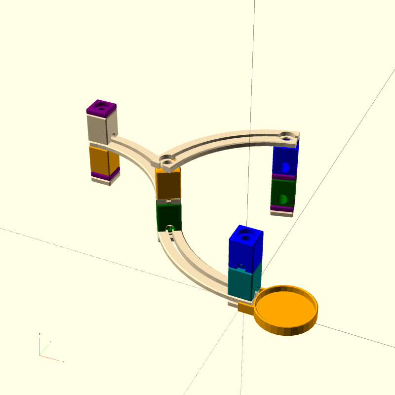

Some [openscad](https://www.openscad.org/) code to plot layouts for the [Quadrilla marble run](https://www.hape.com/us/en/wooden-toys/quadrilla) toy:



Generated from the folllowing openscad file:

```python
use <blocks.scad>;
use <bridges.scad>;
use <special.scad>;

RZ(-90) {
	MiniWhiteBlock() CurveSection(angle=60, d=-1) {
	    TealBlock() BlueBlock();
	    GreenBlock() CurveSection(angle=60) {
	        OrangeBlock() RZ(45) CurveSection(angle=60, d=-1) {}
	        ; WhiteBlock() MiniPurpleBlock();
	    };
	}
	ProjectAlongArc(angle=60, d=-1) { MiniWhiteBlock();
	    ProjectAlongArc(angle=60, d=1)  MiniWhiteBlock() MiniPurpleBlock() OrangeBlock();
	    RZ(45) ProjectAlongArc(angle=60, d=-1)
	      MiniWhiteBlock() MiniPurpleBlock() GreenBlock() MiniPurpleBlock() BlueBlock();

	}
}
MarbleCatcher();

```
And can be rendered like this:

```
$ brew install openscad
$ git clone https://github.com/shuckc/quadri-plot.git
$ cd quadri-plot
$ openscad parts/demo.scad -o demo.png --imgsize 2048,2048 --view=axes --viewall --autocenter
```

There is a tradition of rendering openscad models oversize and shrinking after exporting to anti-alias.

You can also export a 3D STL model (slowly!) using `-o output.stl` which github can [render in interactive 3D](./parts/demo.stl) although STL format loses the colouring information.

See [parts](./parts/) for the naming of components.

Aims
====
* Finish the missing parts
* Some sort of descriptive language to generate above, see [/designs](./designs)
* Layout checker/drc description -> drc -> openscad -> png / pdf / stl
* Embed 3D views with https://www.viewstl.com/
* Generate sequenced instruction booklet style, showing steps to build

