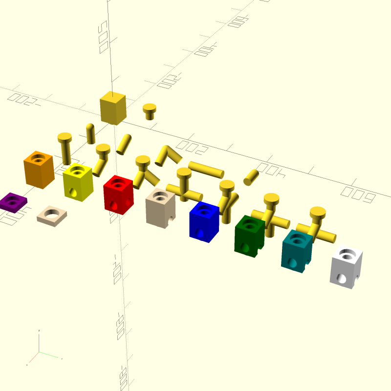

Quadrilla parts
===============

Blocks
------
The shorted 'mini' pieces are grey and purple. Both are square, 12mm high, sides 44mm.

The grey piece:
  - has a hole 31mm in diameter throughout
  - there is a chamfer around all edges seemingly 2mm, so the distance accross the diagonal is 60.5mm

The purple piece has a thinner rectangular thickness 11.5mm
   the same 31mm hole extending 8mm from the face towards the centre, then it narrows to id 26mm
   On the back face, the same extrusion protrudes 6.5mm (od. 30mm) giving overall depth of 18mm.

The blocks are the height of five stacked purple pieces

Yellow block
  - rectangular profile: 60mm height, sides 44mm.
  - Circular protrusion 29mm od, 7mm high
    perhaps allow greater clearance for wooden parts (vs. plastic 30mm od, 6m5mm high)?
  - wooden blocks have a bigger chamfer, they are 59mm accross the diagonal
  - tunnel for marble is 19mm id at exit, centroid is 25mm down from top surface (35mm from base)
  - stud accepting recess is id 31mm, depth 9mm to shelf, then reduces down to 19mm
    all chamfered at 2mm

    mini  wood
    mini  purple
    BlueBlock
    GreenBlock
    OrangeBlock
    RedBlock
    TealBlock
    WhiteBlock (unpainted wood)
    YellowBlock

    clacker green
    clacker red
    clacker orange
    clacker blue
    clacker white

Ramps
-----
Ramps connect between one stack and another. They determine or constrain the distances/placement of the stacks

* semicircle 2
* semicircle 3
* s-curve
* spiral

Special
-------
* musical staircase
* musical cylinder staircase
* orange marble catcher
* flag entry
* marble - sphere 16.5mm diameter

